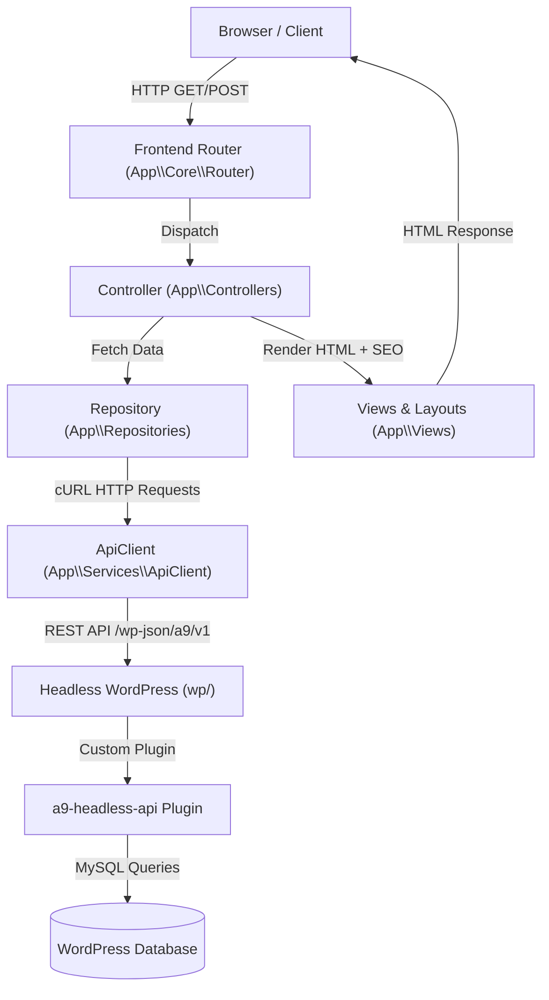
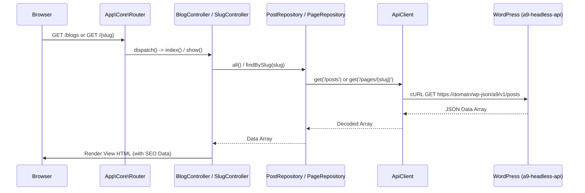

# Spinzel Technical Project Documentation

> Generated from repository analysis using the `project-documentation` skill on 2026-09-10.  
> Primary source of truth: Repository source code, configuration files, and custom plugins.

---

# 1. Executive Summary

## Project Purpose
**Spinzel** is a hybrid headless web platform focused on financial guidance, paid surveys, work-from-home guides, and category-driven affiliate/informational content. It uses a custom lightweight PHP MVC frontend that consumes content and user services from a headless WordPress backend via a custom REST API.

## Current State
The codebase consists of two primary components residing in a single repository:
1. **PHP MVC Frontend Application** (Root directory: `app/`, `routes/`, `index.php`): A lightweight, custom-built PHP 8 application utilizing a custom routing engine, controller/repository layer, cURL-based API client, and PHP template rendering.
2. **Headless WordPress Backend** (Subdirectory: `wp/`): A WordPress installation equipped with DDEV local development configuration (`wp/.ddev`) and custom plugins (specifically `a9-headless-api`) exposing a custom REST API namespace (`/wp-json/a9/v1`).

## Key Findings
- **Decoupled Architecture**: The frontend is completely decoupled from WordPress rendering, consuming data asynchronously or server-side via REST endpoints.
- **Custom REST Namespace**: Content, navigation, authentication, user profiles, categories, and search are exposed through the custom plugin `a9-headless-api` at `/wp-json/a9/v1`.
- **Custom PHP Router**: High-performance, lightweight regex router (`App\Core\Router`) handling fixed routes and dynamic slug catch-all endpoints.
- **Session-Based Token Storage**: Frontend authentication relies on PHP session storage (`$_SESSION['auth']['token']`) holding JWT/Bearer tokens supplied by the backend API.
- **Integrated Ecosystem Plugins**: WordPress contains specialized business plugins including `a9-cpx-research-integration` (surveys/offerwall) and `a9-country-restriction` (geo-targeting).

## Key Risks

| Risk | Severity | Impact |
| --- | --- | --- |
| Disabled SSL Verification | **High** | `ApiClient.php` explicitly sets `CURLOPT_SSL_VERIFYPEER => false` and `CURLOPT_SSL_VERIFYHOST => false`, making server-to-server API calls vulnerable to Man-in-the-Middle (MitM) attacks in production. |
| Hardcoded Production Fallback URL | **Medium** | `app/Config/config.php` hardcodes fallback API URL `https://www.spinzel.com/wp-json/a9/v1` if environment variables are unset. |
| Absence of Automated Tests | **Medium** | No unit, integration, or end-to-end testing frameworks exist in the frontend repository, increasing regression risk. |

## Key Recommendations

| Recommendation | Priority | Reason |
| --- | --- | --- |
| Enable SSL Peer Verification | **High** | Re-enable `CURLOPT_SSL_VERIFYPEER` and `CURLOPT_SSL_VERIFYHOST` in `ApiClient.php` for production environments. |
| Implement Test Suite | **Medium** | Introduce PHPUnit for core router, API client, and repository unit testing. |
| Consolidate Configuration | **Medium** | Clean up redundant keys in `app/Config/app.php` and standardize `.env` loading. |

---

# 2. Project Overview

## Project Details

- **Project Name**: Spinzel
- **Repository Type**: Headless CMS + Custom Frontend (Monorepo-style structure)
- **Primary Language**: PHP 8.x
- **Frontend Framework**: Custom Lightweight PHP MVC (`App\` namespace)
- **Backend CMS**: Headless WordPress (located in `wp/`)
- **API Architecture**: REST API (`/wp-json/a9/v1`) via custom `a9-headless-api` plugin

## Environments

| Environment | Purpose | Configuration / Evidence |
| --- | --- | --- |
| **Local Development** | WordPress local containerized environment | DDEV (`wp/.ddev/config.yaml`), `.env` (`APP_ENV=local`) |
| **Production** | Live site rendering and REST API hosting | Production backend domain (`https://www.spinzel.com/wp-json/a9/v1`), `.env` |

## Entry Points

| Entry Point | Target Component | Location | Purpose |
| --- | --- | --- | --- |
| `index.php` | Frontend Application | [index.php](file:///Users/arunbiradar/Developer/Work/spinzel/index.php) | Web entry point; loads Dotenv, starts session, initializes Router, dispatches request |
| `generate-sitemap.php` | CLI / Cron | [generate-sitemap.php](file:///Users/arunbiradar/Developer/Work/spinzel/generate-sitemap.php) | CLI script to generate static `sitemap.xml` in `public/` and root directory |
| `wp/index.php` | Headless WordPress | [wp/index.php](file:///Users/arunbiradar/Developer/Work/spinzel/wp/index.php) | WordPress core loader for backend administration and REST API endpoints |

---

# 3. Technology Stack

| Layer | Technology | Version / Requirement | Evidence |
| --- | --- | --- | --- |
| **Language** | PHP | ^8.0 / strict types | [composer.json](file:///Users/arunbiradar/Developer/Work/spinzel/composer.json) |
| **Frontend Framework** | Custom PHP MVC | PSR-4 (`App\`) | [app/Core/Router.php](file:///Users/arunbiradar/Developer/Work/spinzel/app/Core/Router.php) |
| **Backend CMS** | WordPress | Core in `wp/` | [wp/wp-includes/version.php](file:///Users/arunbiradar/Developer/Work/spinzel/wp/wp-includes/version.php) |
| **Database** | MySQL / MariaDB | Standard WP DB | [wp/wp-config-ddev.php](file:///Users/arunbiradar/Developer/Work/spinzel/wp/wp-config-ddev.php) |
| **Environment Loader** | `vlucas/phpdotenv` | `^5.6` | [composer.json](file:///Users/arunbiradar/Developer/Work/spinzel/composer.json) |
| **Local Dev Engine** | DDEV | Docker-based | [wp/.ddev/config.yaml](file:///Users/arunbiradar/Developer/Work/spinzel/wp/.ddev/config.yaml) |

## Dependencies

- **`vlucas/phpdotenv` (`^5.6`)**: Environment file loader used in both `index.php` and `generate-sitemap.php`.
- **Custom Plugins (`wp/wp-content/plugins/`)**:
  - `a9-headless-api`: Custom REST endpoints for auth, posts, categories, pages, navigation, search.
  - `a9-cpx-research-integration`: CPX Research survey widget/offerwall integration.
  - `a9-country-restriction`: Geo-blocking and country restriction utilities.
  - `a9-forms`: Form submission and handling.
  - `a9-headless-switch`: Headless redirect behavior toggling.
  - `a9-post-adaptation`: Custom post taxonomy/adaptation behavior.
  - `a9-backup`: Backup operations.

---

# 4. Repository Structure

```text
spinzel/
├── app/                        # Frontend Application Source (PSR-4 App\)
│   ├── Config/                 # Application Configuration (app.php, api.php, config.php)
│   ├── Controllers/            # Route Controllers (HomeController, BlogController, AuthController, etc.)
│   ├── Core/                   # Base Controller and Custom Router Engine
│   ├── Repositories/           # Data Abstraction Layer connecting to Backend API
│   ├── Services/               # Core Services (ApiClient, SitemapService)
│   ├── Support/                # Helpers (Config, View, Url, CountryDetector)
│   └── Views/                  # PHP Views and Layouts (layouts/, auth/, blogs/, etc.)
├── bootstrap/                  # Bootstrap initialization file (app.php)
├── public/                     # Public web root / static assets / generated sitemap.xml
├── routes/                     # Application Route Definitions (web.php)
├── wp/                         # Headless WordPress Installation
│   ├── .ddev/                  # DDEV Containerized Development Config
│   └── wp-content/
│       └── plugins/            # Custom A9 Headless Plugins
├── composer.json               # PHP Dependency Manifest
├── generate-sitemap.php        # Sitemap CLI Generation Script
├── index.php                   # Primary Web Entry Point
└── sitemap.xml                 # Generated Sitemap Document
```

## Directory Responsibilities

| Directory | Responsibility |
| --- | --- |
| `app/Controllers/` | Receives HTTP requests, calls Repositories for data, renders appropriate View with SEO meta. |
| `app/Repositories/` | Encapsulates API request logic to backend `/wp-json/a9/v1` via `ApiClient`. |
| `app/Services/` | Provides system services (cURL HTTP client execution, sitemap building). |
| `app/Views/` | Render templates using standard PHP syntax and layout wrapping (`main.php` / `auth.php`). |
| `wp/wp-content/plugins/a9-headless-api/` | Exposes REST API endpoints consumed by the frontend repositories. |

---

# 5. System Architecture

## Architecture Overview



## Request / Processing Flow



---

# 6. Application Architecture

## Frontend Component Breakdown

### 1. Router (`App\Core\Router`)
- **Location**: [app/Core/Router.php](file:///Users/arunbiradar/Developer/Work/spinzel/app/Core/Router.php)
- **Mechanism**: Registers `GET` and `POST` routes. Matches exact URIs first. If no exact match is found, evaluates regex patterns for parameters like `{slug}`, `{username}`, or `{id}`.
- **Catch-All Slug**: Route `/{slug}` is placed last in [routes/web.php](file:///Users/arunbiradar/Developer/Work/spinzel/routes/web.php#L91) to dynamically handle pages, posts, or categories.

### 2. Base Controller (`App\Core\Controller`)
- **Location**: [app/Core/Controller.php](file:///Users/arunbiradar/Developer/Work/spinzel/app/Core/Controller.php)
- **Functionality**: Standardizes view rendering. Extracts view data, sets SEO attributes (`$pageTitle`, `$pageDescription`, `$pageKeywords`), automatically fetches primary navigation via `NavigationRepository`, and injects the view into `layouts/auth.php` or `layouts/main.php`.

### 3. API Client (`App\Services\ApiClient`)
- **Location**: [app/Services/ApiClient.php](file:///Users/arunbiradar/Developer/Work/spinzel/app/Services/ApiClient.php)
- **Functionality**: Performs cURL HTTP requests (`GET`, `POST`, `PUT`, `DELETE`). Appends `Accept: application/json` and `Authorization: Bearer <token>` headers. Decodes JSON responses into standard PHP arrays. Handles 404s gracefully by returning `null`.

---

# 7. Features & Workflows

## Feature Inventory

| Feature | Description | Relevant Files | Status |
| --- | --- | --- | --- |
| **Authentication** | Login, Register, Logout, Profile Update, Password Reset, Email Verification | [AuthController.php](file:///Users/arunbiradar/Developer/Work/spinzel/app/Controllers/AuthController.php), [AuthRepository.php](file:///Users/arunbiradar/Developer/Work/spinzel/app/Repositories/AuthRepository.php) | **Implemented** |
| **Blog & Post Browsing** | Index listing of blogs and post detail views | [BlogController.php](file:///Users/arunbiradar/Developer/Work/spinzel/app/Controllers/BlogController.php), [PostRepository.php](file:///Users/arunbiradar/Developer/Work/spinzel/app/Repositories/PostRepository.php) | **Implemented** |
| **Category Navigation** | Category listing, filtering, search, and posts-by-category views | [CategoryController.php](file:///Users/arunbiradar/Developer/Work/spinzel/app/Controllers/CategoryController.php), [CategoryRepository.php](file:///Users/arunbiradar/Developer/Work/spinzel/app/Repositories/CategoryRepository.php) | **Implemented** |
| **Dynamic Slug Resolution** | Universal routing catch-all for custom pages, posts, and landing pages | [SlugController.php](file:///Users/arunbiradar/Developer/Work/spinzel/app/Controllers/SlugController.php), [PageRepository.php](file:///Users/arunbiradar/Developer/Work/spinzel/app/Repositories/PageRepository.php) | **Implemented** |
| **Search Functionality** | Keyword search for posts and site content | [SearchController.php](file:///Users/arunbiradar/Developer/Work/spinzel/app/Controllers/SearchController.php), [SearchRepository.php](file:///Users/arunbiradar/Developer/Work/spinzel/app/Repositories/SearchRepository.php) | **Implemented** |
| **Sitemap Generation** | Automatic generation of static `sitemap.xml` via API feed | [generate-sitemap.php](file:///Users/arunbiradar/Developer/Work/spinzel/generate-sitemap.php), [SitemapService.php](file:///Users/arunbiradar/Developer/Work/spinzel/app/Services/SitemapService.php) | **Implemented** |
| **CPX Research Integration** | WordPress plugin for survey offerwall integration | `wp/wp-content/plugins/a9-cpx-research-integration` | **Implemented** |
| **Country Restriction** | Geo-targeting / country filtering capability | `wp/wp-content/plugins/a9-country-restriction`, [CountryDetector.php](file:///Users/arunbiradar/Developer/Work/spinzel/app/Support/CountryDetector.php) | **Implemented** |

---

# 8. API Documentation (`/wp-json/a9/v1`)

The frontend application communicates with the backend via the custom `a9-headless-api` REST namespace:

| Method | Endpoint | Authentication | Description | Repository Method |
| --- | --- | --- | --- | --- |
| `POST` | `/auth/register` | None | User Registration | `AuthRepository::register()` |
| `POST` | `/auth/login` | None | User Login (returns Bearer Token) | `AuthRepository::login()` |
| `POST` | `/auth/logout` | Bearer Token | Invalidate session / token | `AuthRepository::logout()` |
| `GET` | `/auth/profile` | Bearer Token | Retrieve authenticated user profile | `AuthRepository::profile()` |
| `PUT` | `/auth/profile` | Bearer Token | Update user profile details | `AuthRepository::updateProfile()` |
| `GET` | `/posts` | None | Fetch blog posts listing with optional filters | `PostRepository::all()` |
| `GET` | `/posts/{slug}` | None | Fetch single post by ID or slug | `PostRepository::findBySlug()` |
| `GET` | `/categories` | None | Fetch category listing | `CategoryRepository::all()` |
| `GET` | `/pages/{slug}` | None | Fetch page content by slug | `PageRepository::findBySlug()` |
| `GET` | `/navigation` | None | Fetch navigation menus (`?location=primary`) | `NavigationRepository::location()` |
| `GET` | `/search` | None | Perform global keyword search | `SearchRepository::search()` |
| `GET` | `/users/{username}` | None | Fetch public user profile | `AuthRepository::getPublicProfile()` |

---

# 9. Data Architecture

## Overview
Data storage is handled entirely by the WordPress MySQL/MariaDB database in the `wp/` backend directory.

## Core Domain Entities
- **Posts**: Standard blog articles and affiliate guides.
- **Pages**: Static pages (Home, About, Contact, Privacy Policy, Landing pages).
- **Categories / Terms**: Content categorization and filtering taxonomies.
- **Users**: Registered members with authentication tokens, profiles, and survey activity.
- **Navigations**: Custom WordPress menu locations (`primary`, `footer`) mapped to JSON structures for the frontend.

---

# 10. Testing & Quality

## Current State Assessment
- **Automated Tests**: No PHPUnit, Pest, or automated test files were identified in the repository.
- **Code Style**: Strict type declarations (`declare(strict_types=1);`) are consistently enforced across all PHP files in `app/`.
- **Quality Tooling**: PSR-4 autoloading via Composer is enforced.

---

# 11. Security

## Authentication & Authorization
- **Token Handling**: Login responses contain an authentication token stored in PHP session (`$_SESSION['auth']['token']`).
- **Bearer Authentication**: Protected endpoints send the token via standard `Authorization: Bearer <token>` HTTP headers.
- **Session Security**: Session initialized via `session_start()` in `index.php`.

## Secrets Management
- Environment variables managed via `.env` and loaded with `vlucas/phpdotenv`.
- **Sensitive Audit**: No secrets, passwords, or production keys are committed to the codebase. `.env` and `.env.example` files follow standard security practices.

---

# 12. Operations & Deployment

## Development Setup (Local)
1. **WordPress Backend**: Managed via DDEV inside `wp/` directory.
   ```bash
   cd wp
   ddev start
   ```
2. **Frontend Application**: Served via standard PHP built-in web server or Apache/Nginx pointing to the root directory.
   ```bash
   php -S localhost:8000 index.php
   ```

## Sitemap Generation Command
To regenerate static `sitemap.xml`:
```bash
php generate-sitemap.php
```

---

# 13. Technical Debt & Risks

| ID | Issue / Risk | Category | Impact | Location |
| --- | --- | --- | --- | --- |
| **TD-001** | Disabling SSL verification in `ApiClient` | Security | Vulnerable to MitM attacks if used in production without configuration guards. | [ApiClient.php:L162-L163](file:///Users/arunbiradar/Developer/Work/spinzel/app/Services/ApiClient.php#L162-L163) |
| **TD-002** | Redundant key declarations in `app.php` | Maintainability | Duplicate array keys (`env`, `url`, `asset_url`) in `app/Config/app.php`. | [app/Config/app.php:L14-L48](file:///Users/arunbiradar/Developer/Work/spinzel/app/Config/app.php#L14-L48) |
| **TD-003** | Lack of Automated Tests | Quality | Higher regression risk during core refactoring. | `app/` |

---

# 14. Recommendations & Next Steps

1. **Security Hardening**:
   - Update `ApiClient.php` to enable `CURLOPT_SSL_VERIFYPEER` and `CURLOPT_SSL_VERIFYHOST` by default in non-local environments (`APP_ENV !== 'local'`).
2. **Configuration Clean-up**:
   - Refactor [app/Config/app.php](file:///Users/arunbiradar/Developer/Work/spinzel/app/Config/app.php) to remove duplicate key definitions.
3. **Automated Testing**:
   - Add `phpunit/phpunit` to `composer.json` dev-dependencies and write unit tests for `Router`, `ApiClient`, and `Config`.
4. **Error Handling Enhancement**:
   - Replace standard `exit('404 Page Not Found')` in `Router.php` with custom error view rendering (`ErrorController`).

---

# 15. References & Evidence Register

| Claim / Component | Primary Source File | Confidence |
| --- | --- | --- |
| Router regex dispatch | [app/Core/Router.php](file:///Users/arunbiradar/Developer/Work/spinzel/app/Core/Router.php) | **High** |
| API cURL client logic | [app/Services/ApiClient.php](file:///Users/arunbiradar/Developer/Work/spinzel/app/Services/ApiClient.php) | **High** |
| Auth session handling | [app/Controllers/AuthController.php](file:///Users/arunbiradar/Developer/Work/spinzel/app/Controllers/AuthController.php) | **High** |
| WordPress custom API plugin | `wp/wp-content/plugins/a9-headless-api` | **High** |
| DDEV local environment | `wp/.ddev/config.yaml` | **High** |
